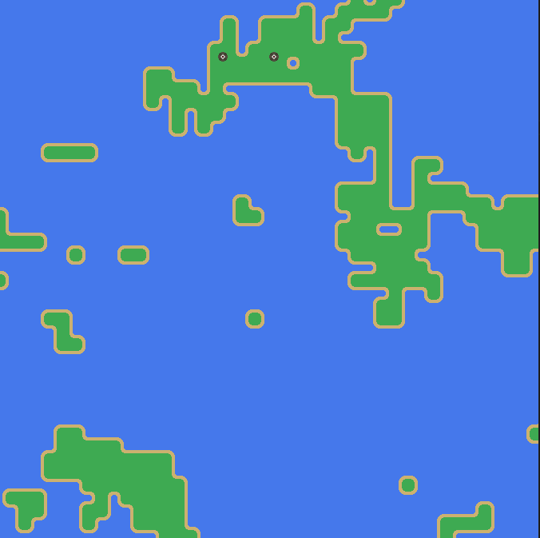
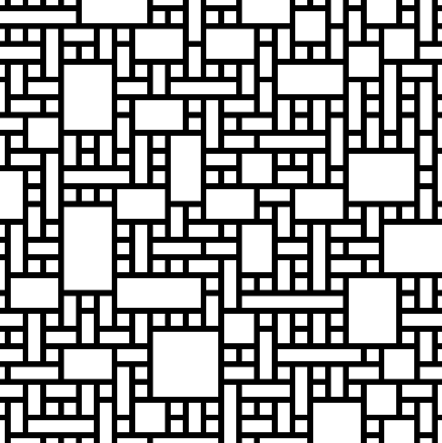

# WaveFunctionCollapse

This is a personal project inspired by a mention of this algorithm in some game dev/ computer graphics videos I stumbled upon. After watching [THIS VIDEO](https://youtu.be/rI_y2GAlQFM "The Coding Train") by The Coding Train, I decided to give it a shot! As a challenge I am currently not referencing any other code or implementation so I can practice my implementation of algorithms with only a high-level understanding of how I want them to work.

V2 Video:

V1 Video:

## Current Status and Usage
The final images are constructed from a small subset of images which I will call a "tileset". Small, pixel-perfect, and square images comprise the tileset and the user defines parameters such as sockets (strings respresenting a joining "key" along each edge of the tile), weighting, rotated variants, etc. in JSON files accompanying each tileset. `wfc.py` reads these JSON files to construct the tilset which the Wave Function Collapse algorithm then procedurally assembles into a larger image using matching rules between adjacent tile sockets.

TODO:

Implement a system to analyze example input images which can detect patterns of tile arrangement and thus build more complex adjacency probabilities and more sophisticated structure in the final image

## Definitions
Tile: an image with encoded information about how it can be assembled

Tileset: the full set of tiles, including all rotational variants

Patch Tile: A tile that will only be inserted into the image if no regular tiles satisfy the constraints at that point in the image. They can address unsolvable regions of the image which occur infrequently

## Log (5/9/23 start)

* 5/8/2023: Switch from graphics.py GraphWin to tkinter GUI builder for displaying output (individual draw calls are slower but has better documentation and flexibility for building out this resource as a tool for an artist)

