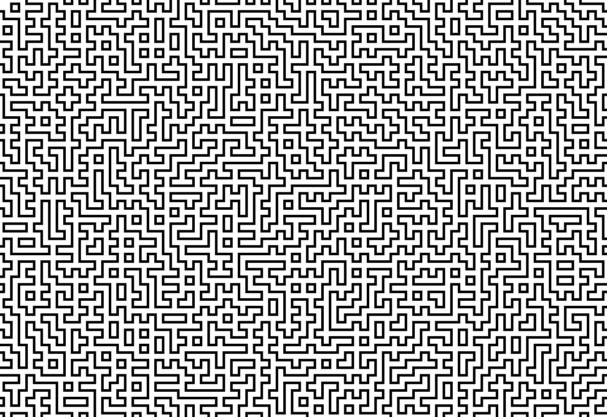
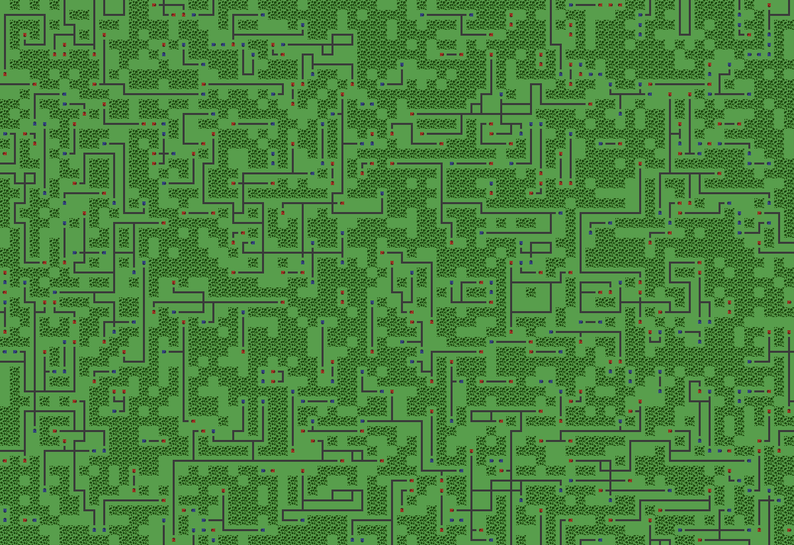
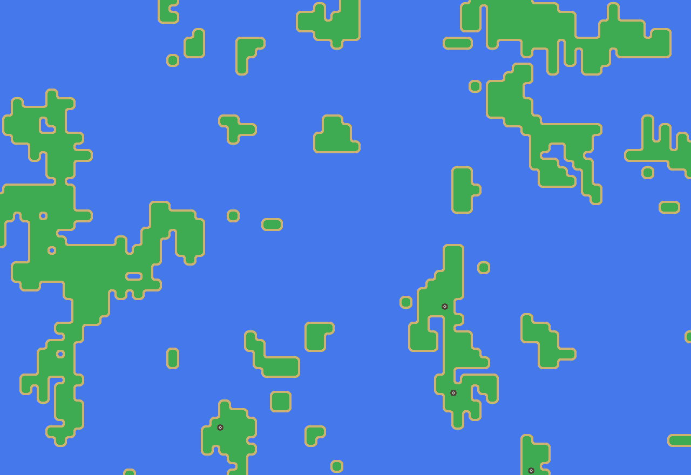
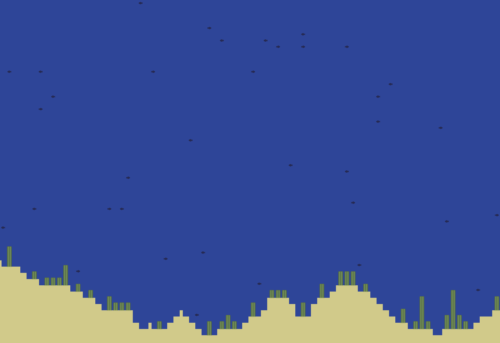
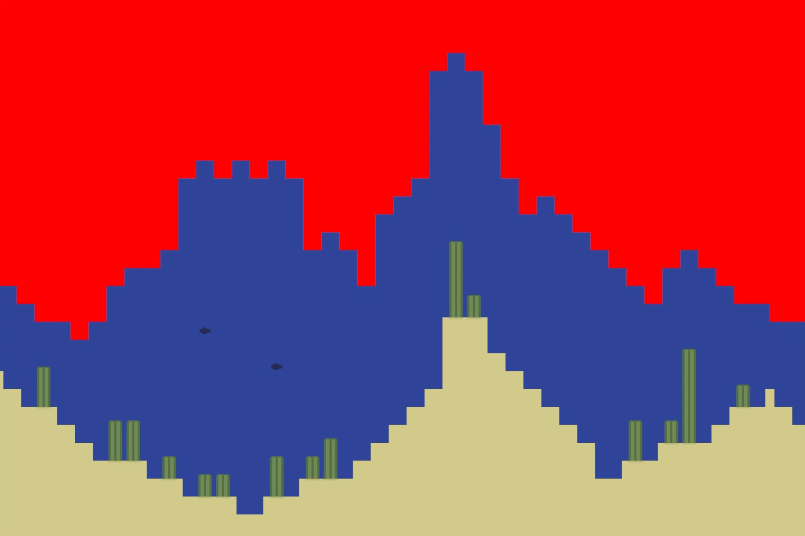
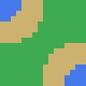
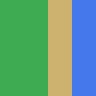
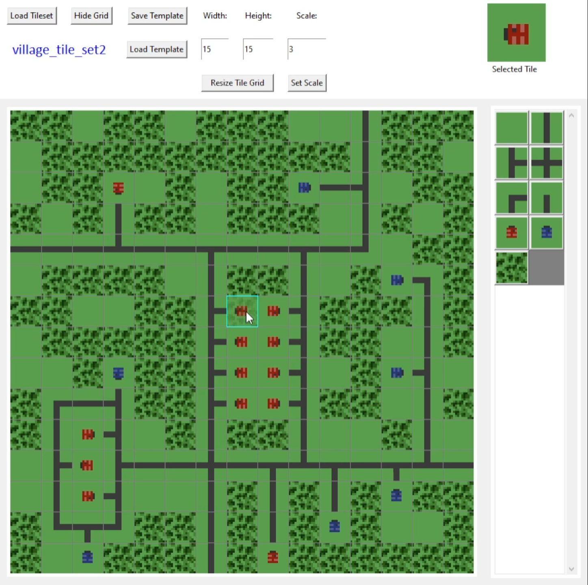
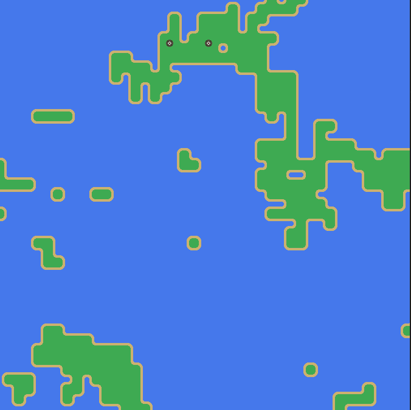
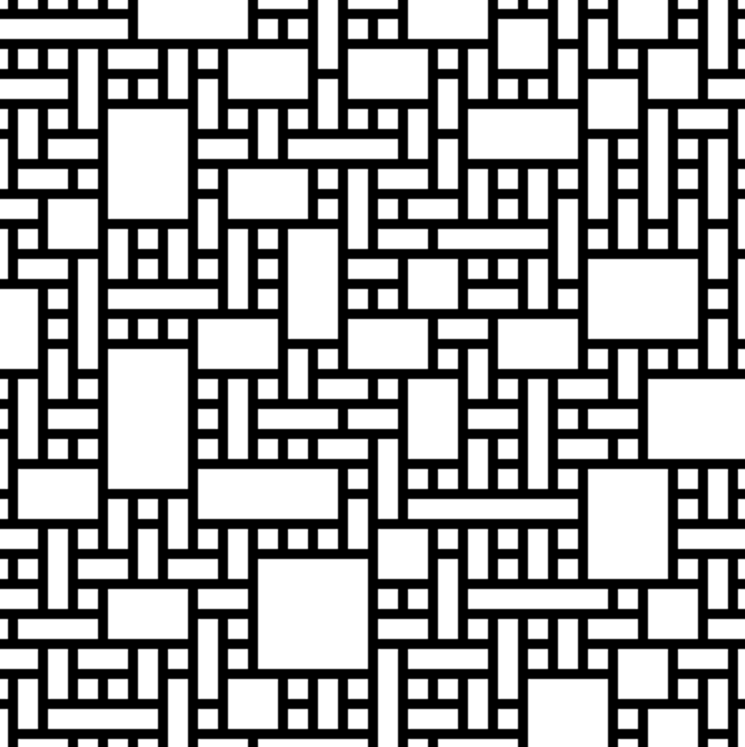

# WaveFunctionCollapse

This is a personal project inspired by a mention of this algorithm in some game dev/ computer graphics videos I stumbled upon. After watching [THIS VIDEO](https://youtu.be/rI_y2GAlQFM "The Coding Train") by The Coding Train, I decided to give it a shot! As a challenge I am currently not referencing any other code or implementation so I can practice my implementation of algorithms with only a high-level understanding of how I want them to work.

The core idea of this algorithm is to procedurally generate a large image from a small set of "tiles" - small, square images which can be assembled together based on a set of rules about edge continuity or adjacency probabilities. 

I have created 4 custom tilesets which can be found in the `assets` directory. Each tile is a 15x15 or 16x16 pixel image (though they may be any desired size greater than 2x2), and has certain user-generated properties recorded in an accompanying JSON file for the tileset (not the JSON with "template" in the name). This data includes an alphabetic string "socket" for each edge of the tile which is a matching key for adjacent tiles with corresponding sockets. The JSON also encodes the number of rotational variants a tile has, the arbitrary "weight" which effects how often that tile will be selected by the algorithm when many tile options are present, whether the tile should only be used to "patch" unsolvable regions of the image (which rarely happens with a well-designed tileset), and an "ignore" flag which allows the user to omit tiles.

V3 Result Images:

|  |  |
| --------------------------- | --------------------------- |
|  |  |

V3 Video:

## Current Status and Usage

NOTE: This current solution is incomplete. Now that I have implemented templates, some areas which can be solved with sockets alone cannot be solved in a way which satisfies both socket and template rules. I'm currently developing a method to resolve error tiles and unsolvable regions. But I still feel like the current state of the project is ready to share on main.

To implement your own tileset, first create a series of images which can be reasonably assembled. Then, copy a JSON (one without "template" in the name) from an existing tileset's directory and enter the information corrsponding to your specific tiles. Then, add your tileset via the main function at the bottom of `wfc_fromtemplate.py`. Finally, execute `wfc_fromtemplate.py` (I'm running Python version 3.8.7).

Notes for the tileset JSON:

* "rotations": this field is an array where the number of elements dictates how many rotated variants of the tile should exist, and the value of each element corresonds to the amount that variant will be rotated (value * 90 degrees clockwise). `[0]` is just the unrotated tile. It means that the image will have no rotated versions and the program will not create more tiles. `[0, 1]` means there is a 90-degree clockwise-rotated version in addition to the original and a secondary tile will thus be created. `[0, 2]` would have the program create the unrotated tile and another rotated by 180 degrees. `[0, 1, 2, 3]` is the maximum number of rotations for a square tile, and 3 additional rotated versions of the tile will be created at 90-degree increments from the nominal orientation.

* "sockets": These can be arbitrarily-long strings (though with more than 3-4 characters, making a complete tileset becomes challenging), where each letter corresponds to a color or set of pixels which will match up with a region on the edge of another tile (e.g. sand texture, line continuity). Most Importantly, the sockets start with the "North" edge of the tile and should be ordered as if you are moving clockwise around the edges of the tile.

For example, the tile below would have the following sockets. N: "ACBB", E: "BBCA", S: "ACBB", W: "BBCA"
Where "A" corresponds to the blue ocean color, "B" is the green grass, and "C" is the sandy beach

And its South edge socket would match with the North socket of this Tile because it is the reverse ("BBCA")

While this socket-based approach allows me to get great results, I'm also working on a better, artist-driven solution. I'm building a GUI to construct image templates which will encode adjacency probabilities for all tiles. This should enable the algorithm to more closely approximate a specific way of assembling tiles as defined by the user, rather than relying solely on sockets. The `TemplateBuilder_GUI` class already has many features implemented and the process of saving and loading templates is solved. `wfc_fromtemplate.py` contains my in-progress solution to applying the encoded probabilities to the original WFC algorithm. The artist-friendly GUI Template Builder currently looks like this:

## Log
* 4/22/2024: Convert lowest entropy uncollapsed neighbor tracking from inefficient 2D array min search to a heapq priority queue. Significantly reduced bloat but starting from scratch on incorporating template matching
* 5/08/2023: Switch from graphics.py GraphWin to tkinter GUI builder for displaying output (individual draw calls are slower but has better documentation and flexibility for building out this resource as a tool for an artist)

* 5/17/2023: Augment seaweed tileset to be fully solvable. Repair `enforce_region()` function to enable setting a rectangular region of the map to a specific tile. Misc. bugfixes highlighted by trying to implement the seaweed tileset.

* 5/24/2023: Build skeleton for template image GUI in separate tkinter-based class.

* 9/15/2023: Refactored project with better OOP principles. Moved and improved `Tile` class and implemented `TileSet`, `Template`, and `TemplateAnalyzer` classes. Updated`TemplateBuilder_GUI` to offload non-GUI processes to TileSet class and fixed several bugs that improve GUI usage when scaling. Standardized indices convention to be (x,y), (col, row), (horizontal, vertical) everywhere in the project. Improved saving and loading of templates and started using integer IDs for template data dictionaries. Made `WFC` compatible with all the above changes. Next steps: make `wfc_fromtemplate` compatible with above changes and fix bugs. Currently brainstorming more sophisticated algorithm for applying analyzed templates.

* 9/20/2023: Improved and interlinked Template Builder and WFC GUIs. Added functionality to `WFC_GUI` and `wfc_fromtemplate.py` to enable setting a seed on the numpy rng to allow for easier debugging. Added mouse click bindings on canvas (along with cyan highlighting of hovered tile) for `WFC_GUI` which now prints the index clicked and data from the `waveTileAdvanced` at that index. Adapted `waveTileAdvanced.compute_entropy()` logic to compute entropy from `possible` member variable if there are no matches between `distribution` and `possible`, and if there are no possible tiles, then entropy is now set to 0.0 instead of np.inf (so that the problem tile will be selected ASAP in collapse function). Also, added boolean `WFC.allow_offtemplate_matches` which allows the collapse funciton to randomly select from the `possible` array when there is no match between `distribution` and `possible`. This means that if the current pattern surrounding the would-be error tile is not in current template (i.e. there is no shared, nonzero index between the two aforementioned arrays), `allow_offtemplate_matches` is `True`, and `possible` has at least one non-zero entry, then the program will relax its requirement of matching patterns from the template image and will just choose a tile that doesn't break socket rules.

## Previous Version Videos:

V2 Video:

V1 Video:

## Definitions
Tile: an image with encoded information about how it can be assembled

Tileset: the full set of tiles, including all rotational variants

Patch Tile: A tile that will only be inserted into the image if no regular tiles satisfy the constraints at that point in the image. They can address unsolvable regions of the image which occur infrequently

